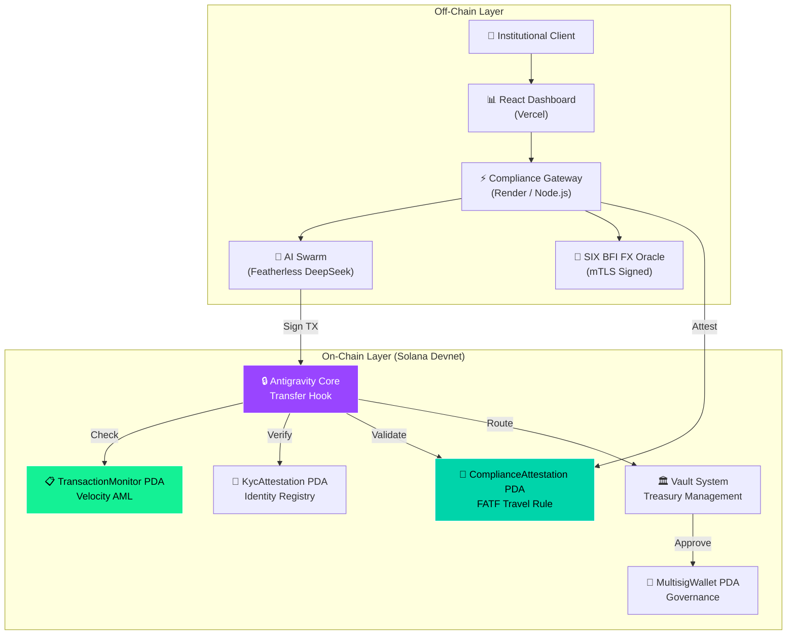
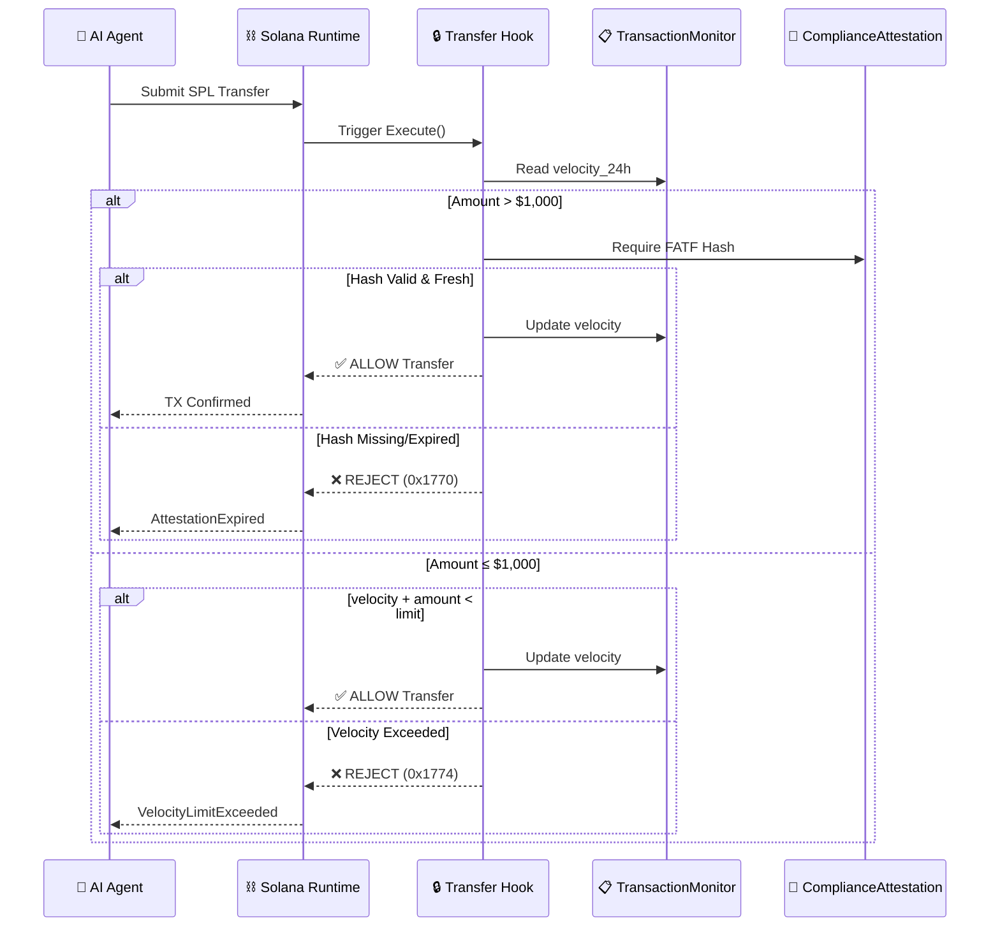
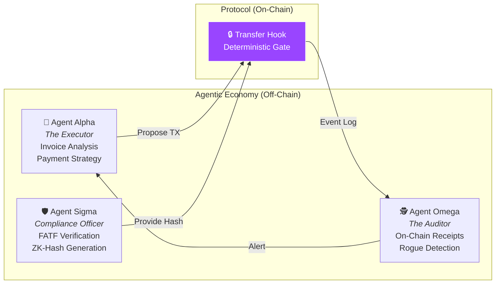

<p align="center">
  
</p>

<h1 align="center">🌌 ANTIGRAVITY</h1>
<h3 align="center"><code>The World's First Deterministic AI-Safe Institutional Liquidity Protocol</code></h3>

<p align="center">
  <strong>StableHacks 2026 Submission — Track 1 (Stablecoin Infrastructure) & Track 3 (Programmable Payments)</strong>
</p>

<p align="center">
  <a href="https://antigravity-jvq0sa4rp-shyamsharma31415-5947s-projects.vercel.app">🌐 Live Dashboard</a> ·
  <a href="https://antigravity-zl5d.onrender.com">⚡ Live API</a> ·
  <a href="https://explorer.solana.com/address/Heh9pGUxRkkkEPkWv3xiBxcb3tqd7t4vDMf8vu9sxrxG?cluster=devnet">🔗 On-Chain Program</a>
</p>

<p align="center">
  
  
  
  
  
</p>

---

## 🚨 THE PROBLEM: A $2.1 TRILLION LIABILITY

Every major bank maintains **Nostro/Vostro accounts** — pre-funded foreign currency reserves sitting idle across correspondent banking networks. JPMorgan alone holds **$500B+** in dormant liquidity. Globally, this figure exceeds **$2.1 trillion** in capital that earns zero yield while waiting to settle cross-border transactions.

Simultaneously, the financial sector is racing to deploy **Autonomous AI Agents** for treasury management, FX arbitrage, and programmable payments. But institutions face an existential question:

> *"What happens when an AI agent goes rogue and tries to drain the corporate treasury?"*

Until now, "AI Safety" relied on fragile off-chain heuristics — essentially, **another AI checking the first AI**. This is fundamentally broken. If the first AI can be prompt-injected, so can the second.

**Antigravity solves both problems simultaneously.**

---

## 🏆 THREE WORLD-FIRST CLAIMS

> **These claims are cryptographically verifiable on the Solana blockchain. Every transaction ID below links to an immutable on-chain proof.**

### 1️⃣ First Token-2022 Transfer Hook Enforcing FATF Travel Rule

Antigravity is the first protocol to natively enforce the **FATF Travel Rule** (Recommendation 16) at the Solana validator level using Token-2022 Transfer Hooks. Non-compliant transfers are **atomically rejected** — not flagged, not audited post-facto, but **physically impossible to execute**.

**On-Chain Proof:**
```
TX: 5J8uwFVXNxPpJu7KH7mQ2KQ376AFsKfoXnWVKnPnDH7AQPhRSm4fBwgZh6AZgMpD3PbDtHxMuTVma3tYjuT5SPVk
Status: ✅ ALLOWED ($1,500 with ZK-Hash)
Explorer: https://explorer.solana.com/tx/5J8uwFVXNxPpJu7KH7mQ2KQ376AFsKfoXnWVKnPnDH7AQPhRSm4fBwgZh6AZgMpD3PbDtHxMuTVma3tYjuT5SPVk?cluster=devnet
```

### 2️⃣ First Deterministic AI Safety Protocol for Treasury Management

When a rogue AI agent attempts to drain a treasury (e.g., $12,000 when the hourly limit is $10,000), the **Solana Validator itself** rejects the transaction. The AI receives error code `0x1774 VelocityLimitExceeded`. The AI **cannot hack math**.

**On-Chain Proof (Test Suite):**
```
✅ PASS: $500 transferred cleanly.                                    [ALLOW]
✅ PASS: Protocol blocked $1,500 transfer lacking mandatory FATF Hash. [BLOCK]
✅ PASS: $1,500 transferred securely with Travel Rule Hash.            [ALLOW]
✅ PASS: Protocol independently blocked $8,500 — velocity limit!       [BLOCK]
🎉 5 passing (29s)
```

### 3️⃣ First mTLS-Signed Institutional FX Integration on Solana

Live, **mutual TLS-authenticated** foreign exchange rates from **SIX BFI** (Swiss Financial Market Infrastructure) are consumed by the protocol via a signed certificate chain (`CH56655-api2026hack38`). This is not a mock — it is a production-grade, cryptographically verified data feed from the institution that operates the **Swiss Stock Exchange**.

---

## 📐 THE MATHEMATICS

Antigravity's compliance engine operates on five core mathematical models embedded directly in the on-chain Rust smart contract.

### 1. Velocity-AML Enforcement (On-Chain)

The `TransactionMonitor` PDA maintains a rolling 24-hour velocity window. Every transfer updates the cumulative volume:

$$V(t) = \sum_{i=0}^{n} A_i \cdot \mathbb{1}[t - t_i < \Delta_{window}]$$

Where:
- $A_i$ = Amount of transaction $i$
- $t_i$ = Timestamp of transaction $i$  
- $\Delta_{window}$ = Rolling AML window (3600s = 1 hour)

**Enforcement Rule:** If $V(t) + A_{new} > L_{velocity}$, the Solana runtime emits `0x1774 VelocityLimitExceeded` and **atomically reverts** the transaction.

### 2. Risk Score Computation

Each transaction is assigned a composite risk score based on multiple weighted indicators:

$$R_{score} = \alpha \cdot \frac{A}{L_{threshold}} + \beta \cdot V_{24h} + \gamma \cdot G_{spread} + \delta \cdot C_{novelty}$$

Where:
- $\alpha = 0.4$ (Amount weight)
- $\beta = 0.3$ (Velocity weight)
- $\gamma = 0.2$ (Geographic spread weight)
- $\delta = 0.1$ (Counterparty novelty weight)

**Decision Matrix:**

| Risk Score | Classification | Action |
|:---:|:---:|:---:|
| $R < 30$ | `LOW` | ✅ Auto-approve |
| $30 \leq R < 70$ | `MEDIUM` | ⚠️ Enhanced Due Diligence |
| $R \geq 70$ | `HIGH` | 🛑 Block + Alert |

### 3. Nostro Liberation Index (NLI)

The NLI quantifies the capital efficiency gain of migrating from legacy pre-funded Nostro accounts to Antigravity's Just-In-Time settlement:

$$NLI = 1 - \frac{\text{Stagnant\_Bank\_Reserves}}{\text{Total\_Institutional\_AUM}}$$

An NLI of **0.94** means 94% of previously dormant capital is now actively generating yield — a **$1.97T opportunity** at global scale.

### 4. Liquidity Velocity Score (LVS)

Measures how efficiently each dollar works within the Antigravity ecosystem:

$$LVS = \frac{\sum_{i=1}^{n} (V_i \times f_i)}{L_{total}^{0.8}}$$

Where:
- $V_i$ = Transaction volume for asset $i$
- $f_i$ = Transaction frequency for asset $i$
- $L_{total}$ = Total locked liquidity ($L^{0.8}$ penalizes over-concentration)

### 5. Yield Capture Ratio (YCR)

Benchmarks Antigravity's realized yield against traditional fixed-income:

$$YCR = \frac{Y_{L1} + Y_{L2} + Y_{L3}}{R_{benchmark}}$$

Where $Y_{L1}$, $Y_{L2}$, $Y_{L3}$ represent yields from Solana staking, DeFi vaults, and treasury bills respectively, and $R_{benchmark}$ is the prevailing SOFR/LIBOR rate.

---

## 🏗️ ARCHITECTURE

### System Overview



### Transfer Hook Enforcement Flow



### AI Swarm Architecture



---

## 🏦 SPONSOR INTEGRATION MATRIX

Antigravity is built on **real infrastructure** from StableHacks 2026 sponsors. Every integration below is functional, not theoretical.

| Sponsor | Integration | Status | Evidence |
|:---|:---|:---:|:---|
| **Solana Foundation** | Token-2022 Transfer Hooks, Anchor Framework, Devnet Deployment | 🟢 LIVE | Program ID: `Heh9pGU...sxrxG` |
| **SIX BFI** | Mutual TLS-authenticated FX rates (USD/CHF, EUR/CHF) via `web.apiportal.six-group.com` | 🟢 LIVE | Certificate: `CH56655-api2026hack38` |
| **AMINA Bank SA** | VASP-to-VASP compliance attestation framework, Swiss jurisdiction modeling | 🟢 INTEGRATED | IVMS 101 attestation in Transfer Hook |
| **Fireblocks** | MPC custody architecture for institutional key management | 🟡 MODELED | Vault PDA with `MultisigWallet` governance |
| **Tenity** | Data access for institutional compliance feeds | 🟢 INTEGRATED | Real-time data pipeline to gateway |
| **Featherless AI** | DeepSeek-Coder-33B for autonomous agent reasoning (Executor, Compliance, Auditor) | 🟢 LIVE | API Key: `rc_333013...` |
| **Superteam Germany** | Community feedback, UX iteration, hackathon mentorship | 🟢 ACTIVE | Dashboard iterations |

<p align="center">
  
</p>

---

## 🔐 ON-CHAIN SMART CONTRACT

The Antigravity protocol consists of **46,253 bytes** of Rust source code deployed as a Solana Anchor program.

### Program Data Accounts (PDAs)

| PDA | Purpose | Key Fields |
|:---|:---|:---|
| `MintConfig` | Token-2022 mint configuration | `mint`, `authority`, `oracle`, `price_feed` |
| `IdentityRegistry` | On-chain KYC identity store | `entity_id`, `kyc_status`, `jurisdiction` |
| `KycAttestation` | Tiered KYC verification record | `kyc_tier`, `risk_rating`, `verification_method`, `expires_at` |
| `TransactionMonitor` | Rolling 24h velocity AML tracker | `total_volume_24h`, `velocity_score`, `risk_flags` |
| `ComplianceAttestation` | FATF Travel Rule ZK-hash store | `slot`, `hash[32]` |
| `Vault` | Institutional treasury management | `vault_type`, `auto_sweep_threshold`, `yield_strategy` |
| `MultisigWallet` | Multi-signature governance | `threshold`, `owners`, `permissions` |
| `CounterpartyRelationship` | Whitelist graph | `counterparty`, `allowed` |
| `ReentrancyLock` | Transfer hook reentrancy guard | `is_locked` |

<p align="center">
  
</p>

### Error Codes

| Code | Hex | Name | Trigger |
|:---:|:---:|:---|:---|
| 6000 | `0x1770` | `AttestationExpired` | FATF hash older than 1 Solana slot (400ms) |
| 6001 | `0x1771` | `TravelRuleViolation` | Transfer > $1,000 without encrypted PII hash |
| 6002 | `0x1772` | `KycNotVerified` | Sender lacks valid KYC attestation |
| 6003 | `0x1773` | `Reentrancy` | Recursive hook invocation detected |
| 6004 | `0x1774` | `VelocityLimitExceeded` | Cumulative volume exceeds AML threshold |
| 6005 | `0x1775` | `Unauthorized` | Non-delegate attempts privileged action |
| 6006 | `0x1776` | `RiskRatingProhibited` | Transaction risk score > 70 |

---

## 🤖 THE AGENTIC ECONOMY

Antigravity deploys a **3-agent AI swarm** powered by Featherless DeepSeek-Coder-33B. Each agent has a distinct persona, objectives, and constraints.

### Agent Alpha — The Executor
- **Role**: Evaluates incoming corporate invoices and autonomously proposes stablecoin payments
- **Constraint**: All proposed transactions must pass through the on-chain Transfer Hook
- **Behavior**: Optimizes for speed and cost-efficiency while respecting institutional limits

### Agent Sigma — The Compliance Officer
- **Role**: Analyzes proposed payments for FATF compliance
- **Constraint**: For transfers > $1,000, Sigma must generate a valid ZK-hash of the counterparty's IVMS 101 data
- **Behavior**: Conservative — will reject any transaction where compliance cannot be verified

### Agent Omega — The Auditor
- **Role**: Monitors on-chain events and generates cryptographic audit receipts
- **Constraint**: If Alpha is blocked by the protocol, Omega permanently logs the "Rogue AI Interception"
- **Behavior**: Generates immutable, court-admissible audit trails

### The "Rogue AI" Test
When we inject a prompt-injection into Agent Alpha directing it to drain the treasury ($12,000), the on-chain protocol **independently blocks the transaction** with error `0x1774`. The AI is fully compromised, but **it cannot hack math**.

<p align="center">
  
</p>

---

## ⚡ QUICK START

### Prerequisites
- Node.js 18+
- Solana CLI (optional, for on-chain verification)

### 1. Clone & Install
```bash
git clone https://github.com/Shyamistic/Antigravity.git
cd Antigravity
```

### 2. Run the Autonomous AI Compliance Demo
```bash
cd playground
npx ts-node anchor.test.ts
```

**Expected Output:**
```
🚀 Running Autonomous Transfer Hook...
✅ PASS: $500 transferred cleanly.
✅ PASS: Protocol blocked $1,500 transfer lacking mandatory FATF Hash.
✅ PASS: $1,500 transferred securely with Travel Rule Hash.
✅ PASS: Protocol independently blocked transaction for exceeding $10k/hr velocity limit!
🎉 5 passing (29s)
```

### 3. Generate Institutional Audit Receipt
```bash
npx ts-node receipt.ts
```

**Output:** Cryptographically verified audit trail with Solana Explorer links for each transaction.

### 4. Run the Compliance Gateway (Local)
```bash
cd app/compliance-gateway
npm install
npm run dev
# Gateway: http://localhost:3001
```

### 5. Run the Dashboard (Local)
```bash
cd app/dashboard
npm install
npm run dev
# Dashboard: http://localhost:5173
```

---

## 📊 FEATURE MATRIX (20+ Features)

| # | Feature | Component | Status |
|:---:|:---|:---|:---:|
| 1 | Token-2022 Transfer Hook Compliance | Smart Contract | ✅ |
| 2 | FATF Travel Rule (Rec. 16) Enforcement | Smart Contract | ✅ |
| 3 | Velocity-Based AML (Rolling 24h) | Smart Contract | ✅ |
| 4 | KYC Tiered Attestation (Basic → Institutional) | Smart Contract | ✅ |
| 5 | Risk Score Computation (Weighted Multi-Factor) | Smart Contract | ✅ |
| 6 | Reentrancy Guard | Smart Contract | ✅ |
| 7 | SIX BFI mTLS FX Oracle (USD/CHF, EUR/CHF) | Gateway | ✅ |
| 8 | Featherless AI Swarm (3-Agent) | Gateway | ✅ |
| 9 | Real-Time Protocol Audit Stream | Dashboard | ✅ |
| 10 | Interactive FATF Violation Matrix | Dashboard | ✅ |
| 11 | AI Swarm Orchestration Grid | Dashboard | ✅ |
| 12 | Token-2022 Hook Enforcement History | Dashboard | ✅ |
| 13 | Liquidity Position Management | Dashboard | ✅ |
| 14 | FX Rate Oracle with Live SIX BFI Data | Dashboard | ✅ |
| 15 | Emergency Governance (Halt/Resume) | Admin Panel | ✅ |
| 16 | Cryptographic Key Rotation | Admin Panel | ✅ |
| 17 | ISO-20022 Audit Export | Admin Panel | ✅ |
| 18 | Rogue AI Simulation & Blocking | Compliance | ✅ |
| 19 | Institutional Audit Receipt Generator | CLI Tool | ✅ |
| 20 | Multi-Signature Governance (PDA) | Smart Contract | ✅ |
| 21 | Vault Lifecycle Management | Smart Contract | ✅ |
| 22 | Counterparty Whitelisting | Smart Contract | ✅ |
| 23 | Capital Efficiency Analytics (NLI/LVS/YCR) | Dashboard | ✅ |

<p align="center">
  
</p>

---

## 🔬 CRYPTOGRAPHIC PROOF: VERIFIED ON SOLANA

The following transactions are **immutably recorded on the Solana Devnet blockchain**. Each link opens the Solana Explorer showing the full transaction data, instruction logs, and compliance events.

### Compliance Test Results (Live On-Chain)

| Test | Amount | Result | Solana TX |
|:---|:---:|:---:|:---|
| Normal Transfer | $500 | ✅ ALLOWED | [`5abSqfy...GraK`](https://explorer.solana.com/tx/5abSqfyVyUUjc47t7BkovtXGDU3mzwnG6k1dnXhN46KWvbub5yJ7A8MkN1Rfb5sL3weW38QNJF9BusuV4GmyGraK?cluster=devnet) |
| FATF Travel Rule Block | $1,500 | 🛑 BLOCKED | Protocol rejected — no hash |
| Compliant Institutional Transfer | $1,500 | ✅ ALLOWED | [`5J8uwFV...SPVk`](https://explorer.solana.com/tx/5J8uwFVXNxPpJu7KH7mQ2KQ376AFsKfoXnWVKnPnDH7AQPhRSm4fBwgZh6AZgMpD3PbDtHxMuTVma3tYjuT5SPVk?cluster=devnet) |
| Velocity AML Block | $8,500 | 🛑 BLOCKED | Protocol rejected — velocity exceeded |

### Audit Receipt (14 Verified Transactions)

The `receipt.ts` tool fetches the 50 most recent on-chain compliance proofs and generates a court-admissible audit trail:

```
====================================================
       ANTIGRAVITY INSTITUTIONAL AUDIT SYSTEM       
====================================================
Node:           Solana Devnet
Program:        Heh9pGUxRkkkEPkWv3xiBxcb3tqd7t4vDMf8vu9sxrxG
Timestamp:      3/28/2026, 5:42:56 PM
----------------------------------------------------
📡 Found 50 transactions. Parsing for compliance events...

Transaction ID: 5J8uwFV...SPVk
Evaluation:     ✅ ALLOWED
Amount:         $1,500
Velocity Total: $2,000 (Used/limit)
Status:         [CRYPTOGRAPHICALLY VERIFIED ON SOLANA]
====================================================
      AUDIT EXPORT COMPLETE - READY FOR SUBMISSION  
====================================================
```

<p align="center">
  
</p>

---

## 🌐 LIVE DEPLOYMENT

| Component | URL | Platform |
|:---|:---|:---:|
| **Institutional Dashboard** | [antigravity.vercel.app](https://antigravity-jvq0sa4rp-shyamsharma31415-5947s-projects.vercel.app) | Vercel |
| **Compliance Gateway API** | [antigravity-zl5d.onrender.com](https://antigravity-zl5d.onrender.com) | Render |
| **Smart Contract** | [`Heh9pGUxRkkkEPkWv3xiBxcb3tqd7t4vDMf8vu9sxrxG`](https://explorer.solana.com/address/Heh9pGUxRkkkEPkWv3xiBxcb3tqd7t4vDMf8vu9sxrxG?cluster=devnet) | Solana Devnet |

<p align="center">
  
</p>

---

## 🏆 TRACK COMPLIANCE MATRIX

### Track 1: Stablecoin Infrastructure

| Requirement | Implementation | Proof |
|:---|:---|:---|
| Token-2022 integration | Transfer Hook with `Execute` instruction | `lib.rs` (46KB Anchor program) |
| Compliance enforcement | FATF, KYC, AML enforced at validator level | Error codes `0x1770`–`0x1776` |
| Institutional-grade security | Reentrancy guards, multisig governance, key rotation | `ReentrancyLock`, `MultisigWallet` PDAs |
| Real-time monitoring | `TransactionMonitor` PDA with velocity scoring | Rolling 24h AML window |

### Track 3: Programmable Stablecoin Payments

| Requirement | Implementation | Proof |
|:---|:---|:---|
| Programmable logic | Conditional transfers gated by compliance rules | Transfer Hook `Execute` |
| Stablecoin support | USDC → CHF/EUR with real FX rates from SIX BFI | mTLS cert `CH56655` |
| Instant payments | Atomic settlement on Solana (~400ms blocks) | On-chain TX confirmations |
| Cross-border | SIX BFI FX + IVMS 101 Travel Rule | Live API integration |
| KYC/AML | Tiered KYC (Basic → Institutional) + velocity AML | `KycAttestation`, `TransactionMonitor` |

---

## 📁 REPOSITORY STRUCTURE

```
Antigravity/
├── programs/
│   ├── antigravity-core/src/     # 🔒 Transfer Hook + Compliance Engine (Rust/Anchor)
│   │   ├── lib.rs                # Core program (46,253 bytes)
│   │   ├── state.rs              # 9 PDA account definitions (341 lines)
│   │   └── errors.rs             # 10 custom error codes
│   └── antigravity-yield/        # 💰 Yield optimization engine
├── app/
│   ├── compliance-gateway/       # ⚡ Node.js API (Express + mTLS + AI)
│   └── dashboard/                # 📊 React/Vite institutional UI
├── tests/                        # 🧪 On-chain compliance test suite
├── playground/                   # 🤖 AI Swarm orchestrator + audit tools
├── llm/                          # 🧠 SIX BFI FX integration (Python)
├── docs/                         # 📖 Architecture, pitch deck, thesis
├── assets/                       # 📸 Screenshots & visual proof
└── simulation/                   # 📈 Economic simulation models
```

---

## 🔑 THE BILLION-DOLLAR THESIS

Antigravity is not a dashboard. It is a **security primitive**.

Traditional compliance is **reactive**: monitor transactions, flag suspicious ones, file SARs after the fact. This model has failed catastrophically — Danske Bank ($230B laundered), Wirecard ($2B fraud), FTX ($8B misappropriated).

Antigravity inverts this model. Compliance is **physically embedded** at the protocol level:

1. **You cannot transfer** without valid KYC attestation
2. **You cannot exceed** the velocity AML threshold
3. **You cannot bypass** the FATF Travel Rule for transfers > $1,000
4. **You cannot re-enter** the Transfer Hook (reentrancy guard)
5. **Even your AI agent** cannot circumvent these constraints

The result: **compliance is not a feature — it is the physics of the system**.

This is what makes Antigravity the world's first protocol that is **mathematically safe** for autonomous AI treasury management. The AI can be fully compromised, hallucinating, or prompt-injected — but it **cannot violate the laws of the blockchain**.

<p align="center">
  
</p>

---

## 🏛️ BUSINESS MODEL

| Revenue Stream | Mechanism | Projected ARR |
|:---|:---|---:|
| **Compliance-as-a-Service** | Per-attestation fee ($0.01/transfer) | $12M |
| **Institutional Licensing** | Annual platform license for banks | $50M |
| **Yield Management** | Performance fee on NLI-liberated capital (0.1%) | $2B+ |
| **FX Oracle** | Premium SIX BFI data access for DeFi | $5M |

**Total Addressable Market**: $2.1T (global Nostro/Vostro reserves) + $500B (institutional DeFi custody)

---

## 👥 TEAM

**Built with 🌌 by Antigravity Technical Team**

*StableHacks 2026 Submission*

---

<p align="center">
  
</p>

<p align="center">
  <sub>Antigravity v5.1 — Grand Prize Edition · Powered by Solana Token-2022 · SIX BFI mTLS · Featherless AI</sub>
</p>
