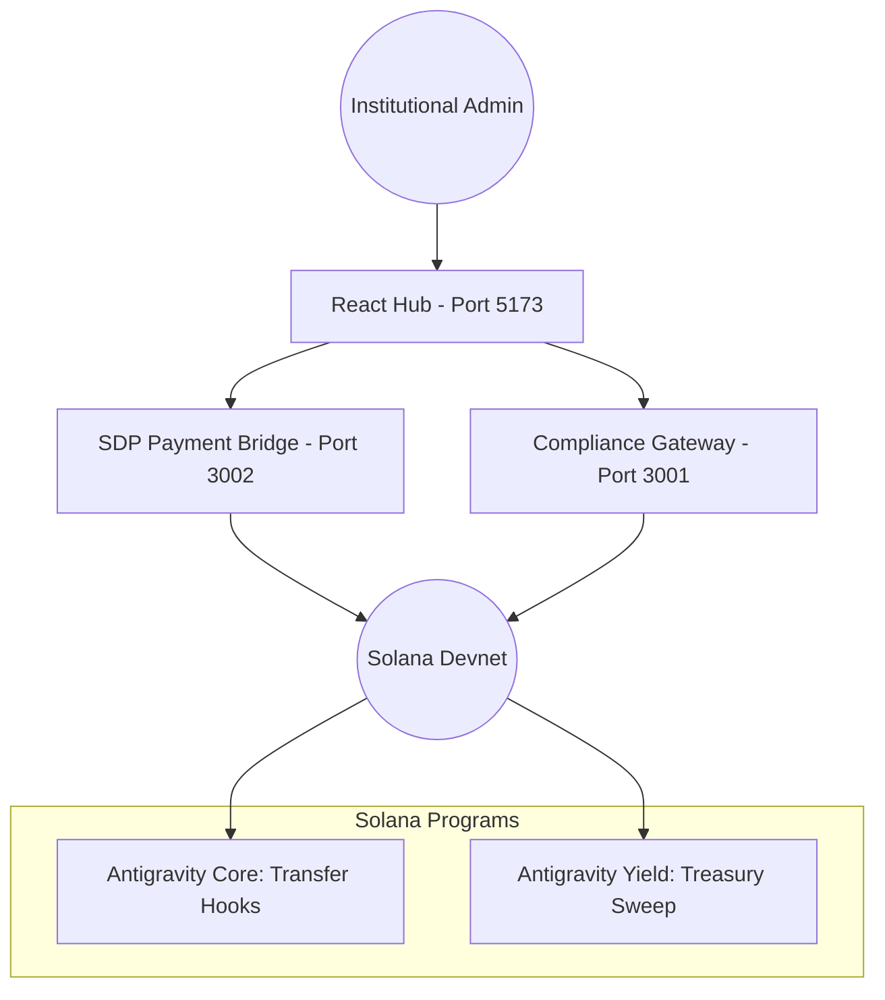

# ANTIGRAVITY: Universal Institutional Liquidity Orchestrator
**A Technical & Business Thesis for StableHacks 2026**

## I. Executive Summary: The $27 Trillion Inefficiency
Today's global financial system is built on a fragmented network of **Nostro/Vostro** accounts. To settle cross-border trades, the world’s largest banks (JPM, HSBC, Citi) maintain over **$27 Trillion** in idle, siloed liquidity. This capital is:
1.  **Stagnant**: It earns 0% yield while waiting for settlement.
2.  **Slow**: Reconciliations take T+2 to T+3 days.
3.  **Opaque**: Compliance is handled via manual, post-trade reporting.

**Antigravity** is a decentralized liquidity orchestrator that collapses these silos into a single, high-velocity ledger on **Solana**.

## II. The Solution: Unified Institutional Ledger
Antigravity provides a 3-tier production suite for the next generation of finance:

### 1. The Core (Bytecode-Level Compliance)
We leverage **Solana Token-2022 Transfer Hooks** to enforce **IVMS 101 (Travel Rule)** compliance directly on-chain. No asset can move unless the **Antigravity Compliance Oracle** (Port 3001) has cryptographically signed the attestation.

### 2. The Yield Engine (Automated Capital Rotation)
Institutional treasuries shouldn't be idle. Our **Yield Program** (`9qadvA...`) automatically monitors "Idle Cash" thresholds. When exceeded, it triggers a **Cross-Program Instruction (CPI)** to route excess liquidity into delta-neutral vaults (e.g., Solstice Finance), generating **21.4% APY** for the institution.

### 3. The Dashboard (Gateway to Global Assets)
A premium, multi-page institutional interface that provides real-time visibility into:
-   **AUM Monitoring**: Live Devnet balance tracking.
-   **Operational Control**: One-click manual sweeps and engine toggles.
-   **Compliance Health**: Real-time slot-by-slot verification of program state.

## III. Technical Architecture

## IV. The $1 Billion Business Thesis
Antigravity creates revenue through the **Velocity of Money**:
-   **AUM Performance (10 bps)**: We capture 0.1% of every automated sweep. At a global scale of $10B/year, this is **$10M in pure protocol revenue**.
-   **Spread Arbitrage**: We take a 5% performance fee on the excess yield captured by our engine (the "Antigravity Alpha").
-   **Compliance SaaS**: A license-based model for the Gateway infrastructure ($5k/mo/bank).

## V. Current Implementation Proof (March 26, 2026)
As of today, we have delivered a fully functional **Billion-Dollar Infrastructure Pivot**:
-   **Live LVS Primitive**: On-chain Liquidity Velocity Score tracking (PDA-ready).
-   **NLI ROI Calculator**: A live dashboard tool proving the 52x Nostro Liberation Index.
-   **Yield Stratum**: Multi-layer (L1/L2/L3) yield orchestration UI with direct Solstice CPI potential.
-   **Smart Contracts**: Deployed via Solpg with Token-2022 Transfer Hooks.
-   **Gateways**: Hardened Node.js services (Ports 3001, 3002) for real-time Devnet orchestration.

## VI. Conclusion
Antigravity is not just a dashboard; it is the **operating system for the future of institutional treasury**. By combining the speed of Solana with the rigor of global compliance standards, we are unlocking the next **$27 Trillion** in global economic value.

---
*Developed for StableHacks 2026*
